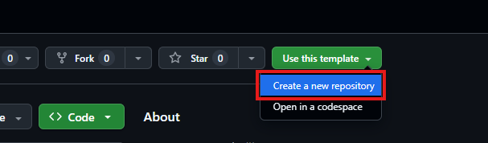
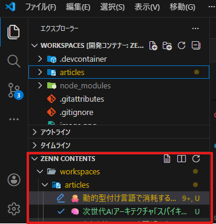

# Zenn Contents

Zenn CLIとDev Containersを活用して、Zennのコンテンツをローカルで管理・プレビューするためのリポジトリテンプレートです。

## 環境構築

[Dev Containers](https://marketplace.visualstudio.com/items?itemName=ms-vscode-remote.remote-containers) を使って開発環境を構築します。

### 前提条件

- [Docker Desktop](https://www.docker.com/products/docker-desktop/)
- [Visual Studio Code](https://code.visualstudio.com/)
- VS Code 拡張機能: [Dev Containers](https://marketplace.visualstudio.com/items?itemName=ms-vscode-remote.remote-containers)

## 使い方

### リポジトリの用意

以下、[1. GitHub リポジトリの準備](#1-github-リポジトリの準備) の手順でリポジトリを作成し、ローカルにクローンしておいてください。

### 開発環境の起動

VS Code でリポジトリを開き、左下の「><」アイコンをクリックして「Reopen in Container」を選択します。  
初回はコンテナイメージのビルドが行われるため、数分かかることがあります。

### プレビューの起動

```bash
zenn preview
```

ブラウザで `http://localhost:8000` にアクセスするとプレビューを確認できます。

### Zenn CLI のアップデート

```bash
npm install -g zenn-cli@latest
```

## ディレクトリ構成

```bash
.
├── .devcontainer/
│   ├── devcontainer.json   # Devcontainer 設定
│   └── Dockerfile          # コンテナイメージ定義
├── articles/               # 記事ファイル（.md）
├── books/                  # 本のディレクトリ
├── .gitignore
└── README.md
```

## GitHub との連携

Zenn は GitHub リポジトリと連携することで、`main` ブランチへの push を契機に記事が自動公開されます。

### 1. GitHub リポジトリの準備

当リポジトリはテンプレートリポジトリとして公開されているため、画像のボタンから GitHub 上でリポジトリを作成できます。

作成した後、ローカルにクローンして VS Code で開き、Dev Container を起動してください。



### 2. 既にオンラインエディタで作成した記事がある場合

すでに Zenn で公開している記事がある場合は、Zennのエクスポート機能を使って記事・本のデータをダウンロードしてください。  
[Zenn のエクスポートページ](https://zenn.dev/dashboard/export) → 「エクスポートする」からダウンロードできます。  

その後、エクスポートしたデータをローカルの `articles` ディレクトリや `books` ディレクトリに配置してください。

※以下の項目で Zenn と GitHub を連携しても、保存済みの記事は自動でリポジトリに追加されません。  

### 3. Zenn と GitHub を連携する

1. [Zenn のダッシュボード](https://zenn.dev/dashboard/deploys) にアクセス
2. 「GitHub からのデプロイ」→「リポジトリを連携する」を選択
3. 連携したいリポジトリを選択して保存

連携後は `main` ブランチへ push するたびに Zenn 上の記事・本が自動で更新されます。

### 4. ブランチ運用フロー

執筆中の記事を誤って公開しないよう、作業ブランチを分けて運用することを推奨します。

```bash
main         ← Zenn が監視する公開用ブランチ
└── draft    ← 執筆・編集作業用ブランチ（任意の名前で OK）
```

## 5. 記事の作成について

[Zenn Edditor](https://marketplace.visualstudio.com/items?itemName=negokaz.zenn-editor)を利用して記事の作成やプレビューを行うことができます。

### ★新しい記事を書き始めるとき

まず、作業用のブランチを作成してから記事ファイルを生成することを推奨します。

```bash
# 作業ブランチを作成して移動
git switch -c draft
```

記事ファイルはZenn Edditorの機能で簡単に生成できます。



### ★記事の執筆

記事の内容は、VS Code 上で Markdown ファイルを編集して執筆します。

プレビューは `zenn preview` コマンドで起動したローカルサーバー上で確認できます。

※VSCode拡張機能 Zenn Editor のプレビュー機能は、編集後の内容を反映するのに一度タブを閉じて再度開く必要があるため、ローカルサーバーのプレビューで確認することを推奨します。

### ★記事を公開するとき

main ブランチへマージして push することで、Zenn 上に記事が公開されます。

```bash
# main ブランチへマージして push
git switch main
git merge draft
git push origin main
```

push 後、数秒〜数分で Zenn 上に反映されます。

### ★執筆中の記事を下書き状態に保つ

記事の Front Matter で `published: false` にしておくと、`main` へ push しても非公開のまま管理できます。  
Publicationのメンバーにレビューしてもらう際などに便利です。

```yaml
---
title: "記事タイトル"
emoji: "📝"
type: "tech"
topics: []
published: false   # true にすると公開される
---
```

## 参考

- [Zenn CLI の使い方](https://zenn.dev/zenn/articles/zenn-cli-guide)
- [Zenn のコンテンツ作成ガイド](https://zenn.dev/zenn/articles/editor-guide)
- [GitHub リポジトリ連携の手順](https://zenn.dev/zenn/articles/connect-to-github)
